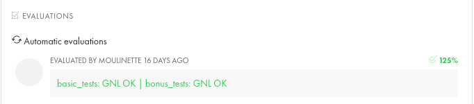

# GNL

O get_next_line é uma função que retornar uma linha do arquivo lido.

[Post explicando como foi desenvolvido](https://hector.dev.br/2021/08/27/GNL-get-next-line-42/)

##### Principais aprendizados:

- Assim como na libft, a organização foi essencial e aprimorada
- Aprendi a resolver leaks de memória
- Aprendi como o File Descriptor funciona
- Aprendi como uma variável estática funciona

---

##### Mandatory part

- Calling your function get_next_line in a loop will then allow you to read the text
  available on the file descriptor one line at a time until the end of it.
-  Your function should return the line that has just been read. If there is nothing
  else to read or if an error has occurred it should return NULL.
-  Make sure that your function behaves well when it reads from a file and when it
  reads from the standard input.
-  libft is not allowed for this project. You must add a get_next_line_utils.c file
  which will contain the functions that are needed for your get_next_line to work.
-  Your program must compile with the flag -D BUFFER_SIZE=xx which will be used
  as the buffer size for the read calls in your get_next_line. This value will be
  modified by your evaluators and by the moulinette.
-  Your read must use the BUFFER_SIZE defined during compilation to read from
  a file or from stdin. This value will be modified during the evaluation for testing
  purposes.
-  In the header file get_next_line.h you must have at least the prototype of the
  function get_next_line.

---

#### Evaluation



---

##### Execução:

1. Compilar a get_next_line:

```shell
gcc -Wall -Wextra -Werror -D BUFFER_SIZE=42 <files>.c
```

